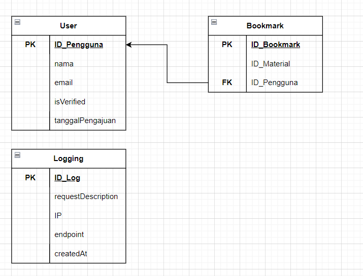

# StudyDojo App Service SOAP

## Deskripsi Web Service

Service SOAP pada StudyDojo App digunakan untuk mengelola permintaan verification dari StudyDojo untuk melakukan diskusi dan membalas diskusi pada StudyDojo Premium serta mencatat data bookmark oleh user. Service ini juga digunakan untuk logging pada request-request tersebut.

## Skema Basis Data

**User**

1. ID_Pengguna: int
2. nama: string
3. email: string
4. isVerified : 'unverified', 'accepted', 'rejected'
5. tanggalPengajuan : timestamp

**Logging**

1. ID_Log: string
2. requestDescription: string
3. IP: string
4. endpoint: string
5. createdAt: string

**Bookmark**

1. ID_Bookmark: int
2. ID_Material: int
3. ID_Pengguna: int

## Cara Menjalankan

- Clone repository ini
- Pindah ke root folder
- Run `mvn clean package`
- Run `docker compose up`
- Fitur soap dapat dijalankan pada browser di `http://localhost:6060/api?wsdl`

## Endpoint

- /api
  - newRecord(), mencatat log baru yang masuk pada setiap request
  - getAllLog(), mengambil seluruh log yang ada pada database
  - getAllRequest(), mengambil seluruh request verifikasi
  - updateStatus(), mengubah status verifikasi dari user
  - getUserStatus(), mengambil status verifikasi dari user
  - addUserRequest(), menambahkan request verifikasi dari user
  - addBookmark(), menambahkan bookmark pada material oleh user
  - findBookmarkByID(), mengambil seluruh bookmark milik user

## Pembagian Tugas

- Fungsi newRecord() : 13521106
- Fungsi getAllLog() : 13521106
- Fungsi sendemail(): 13521066
- Fungsi getAllRequest() : 13521066
- Fungsi updateStatus() : 13521066
- Fungsi getUserStatus() : 13521066
- Fungsi addUserRequest() : 13521066
- Fungsi addBookmark() : 13521051
- Fungsi findBookmarkByID() : 13521051
